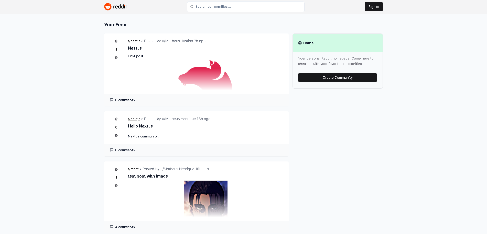
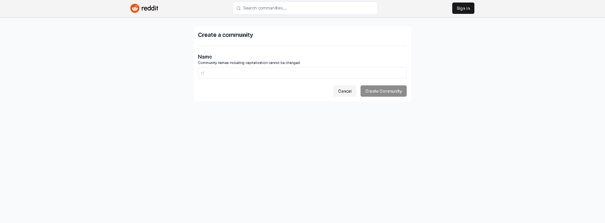
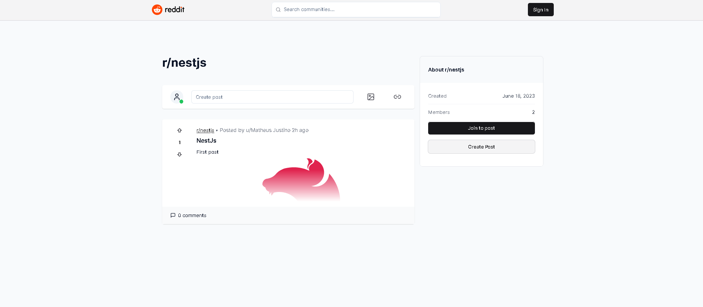
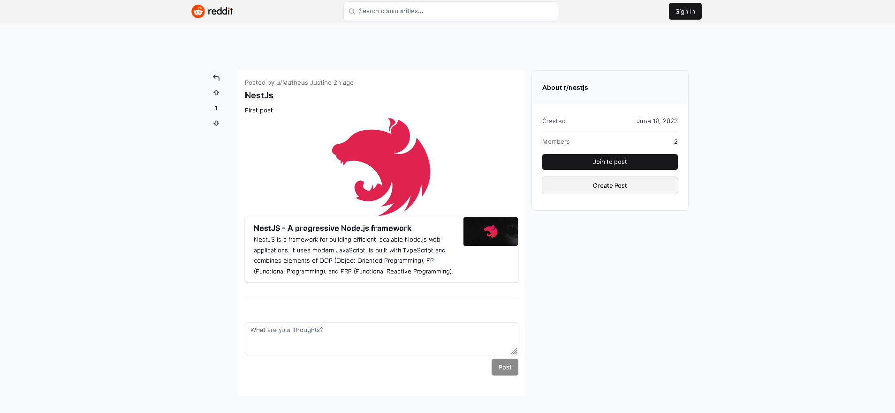
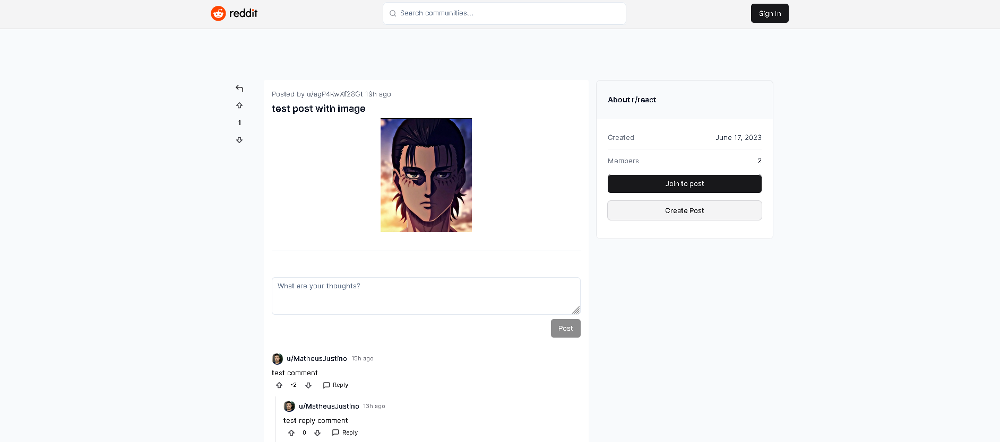

# Reddit Fullstack Application

## Application

    This application tries to replicate the main features of the Reddit forum. It's possible
    to view communities, community posts, a specific post, make comments and vote on posts
    and comments, just create an account using Google.

## Technologies

This application was developed with **`NextJs`**, **`NextAuth (Google Provider)`**, **`TailwindCSS`**, **`Shadcn-ui`**,
**`Prisma`**, **`MySQL`**, **`Uploadthing`** and **`Upstash`**.

## DEMO

You can check the **[demo here](https://reddit-fullstack-app.vercel.app/)**.

## Screenshots

